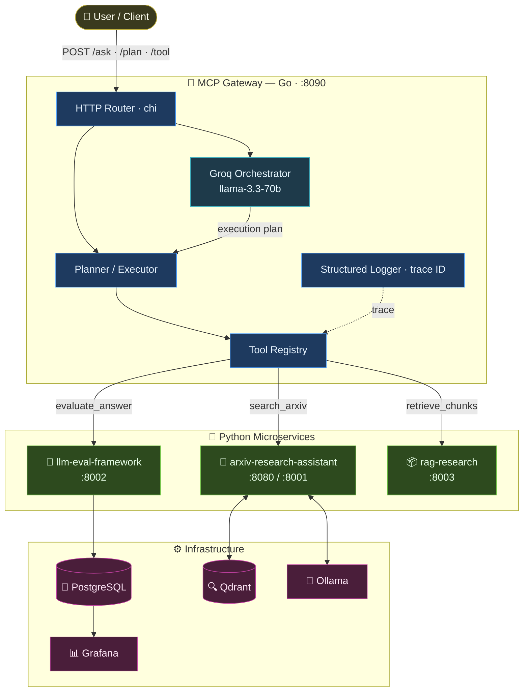

# MCP Gateway — Architecture Diagram

```mermaid
flowchart TD
    USER(["👤 User / Client"])

    subgraph GW["🧠  MCP Gateway — Go · :8090"]
        direction TB
        ROUTER["HTTP Router · chi"]
        REGISTRY["Tool Registry"]
        PLANNER["Planner / Executor"]
        GROQ["Groq Orchestrator\nllama-3.3-70b"]
        LOGGER["Structured Logger · trace ID"]
    end

    subgraph PY["🐍  Python Microservices"]
        direction LR
        ARXIV["📄 arxiv-research-assistant\n:8080 / :8001"]
        EVAL["🔬 llm-eval-framework\n:8002"]
        RAG["📦 rag-research\n:8003"]
    end

    subgraph INFRA["⚙️  Infrastructure"]
        direction LR
        PG[("🐘 PostgreSQL")]
        QDRANT[("🔍 Qdrant")]
        OLLAMA["🦙 Ollama"]
        GRAFANA["📊 Grafana"]
    end

    USER -->|"POST /ask · /plan · /tool"| ROUTER
    ROUTER --> GROQ
    ROUTER --> PLANNER
    GROQ -->|"execution plan"| PLANNER
    PLANNER --> REGISTRY
    REGISTRY -->|"search_arxiv"| ARXIV
    REGISTRY -->|"evaluate_answer"| EVAL
    REGISTRY -->|"retrieve_chunks"| RAG
    ARXIV <--> QDRANT
    ARXIV <--> OLLAMA
    EVAL --> PG
    PG --> GRAFANA
    LOGGER -.->|"trace"| REGISTRY

    classDef gateway fill:#1e3a5f,stroke:#4a9eff,color:#e8f4ff
    classDef groq    fill:#1e3a4a,stroke:#40b0bf,color:#e8f8ff
    classDef python  fill:#2d4a1e,stroke:#6abf40,color:#e8ffe8
    classDef infra   fill:#4a1e3a,stroke:#bf40a0,color:#ffe8f8
    classDef user    fill:#3a3a1e,stroke:#bfb040,color:#fffff0

    class ROUTER,REGISTRY,PLANNER,LOGGER gateway
    class GROQ groq
    class ARXIV,EVAL,RAG python
    class PG,QDRANT,OLLAMA,GRAFANA infra
    class USER user
```
